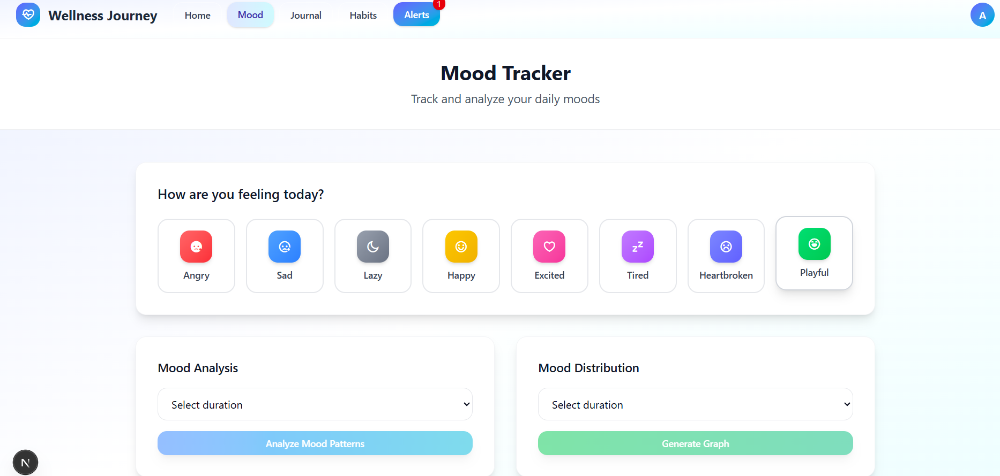

## Project Description 

This is a [Next.js](https://nextjs.org) project named Mental health tracker and it a full stack web that includes both frontend and backend functionalities along with AI integration.Here you can track and analyze your mood,habits and can write your daily journal and also can analyze how your day was in journal analysis. Alert option notify you to enter your mood, journal and habits information on daily basis.


## Login And Dashboard 

User login via Google account using firebase and then is directed to the dashboard where he can use the functionalities the web provides.


## Mood Tracking And Analysis 

Your can insert your moods at any moment in day by selecting the available moods.And here you can also track your previous moods they are displayed on the side of the screen. You can also track your moods of a certain via frequency graph and can also get AI analysis suggesting you how to maintain the moods that really help you in maintaining good mental health.


##  Journal Writing And Analysis 

Your can write your daily journal,also you can track your previous writing available at the side of the screen and also you can analyze you day with the help of AI that helps you to summarize how your day was and how it effect mental health and suggestions to maintain good metal health.Also note that you can write journal once a day.


## Habits Tracking

Here you enter your daily habits and also keep track of previous days that either you are continuing with the habits the really have positive impact on your mental health.you select the habit that you have done in a day and can also analyze the previous habits via AI that suggest how to keep with these habit if you are consistent and also suggest some more habits to maintain good metal health.you can enter your habits once a day.


## Alert 

Here you simply get an alert if on a day you did not submit your mood, write a journal or enter your habits so an alert message appear notifying user to enter the details.


## How To Run

First, run the development server:

```bash
npm run dev
Open [http://localhost:3000](http://localhost:3000) with your browser to see the result.

You can start editing the page by modifying `app/page.tsx`. The page auto-updates as you edit the file.

This project uses [`next/font`](https://nextjs.org/docs/app/building-your-application/optimizing/fonts) to automatically optimize and load [Geist](https://vercel.com/font), a new font family for Vercel.
```
## Ending 

It is one of the great real world project and wil more function and efficiency can be made compatible with real world.


